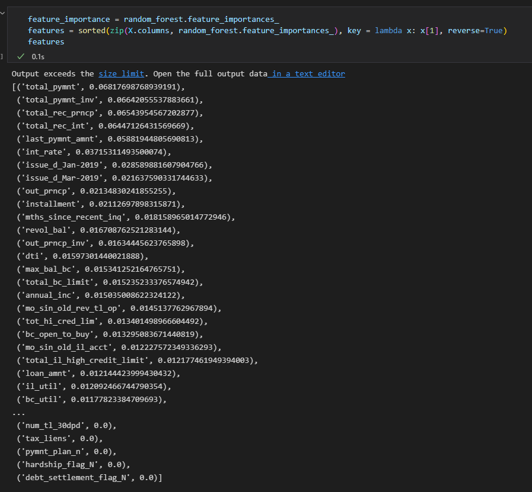
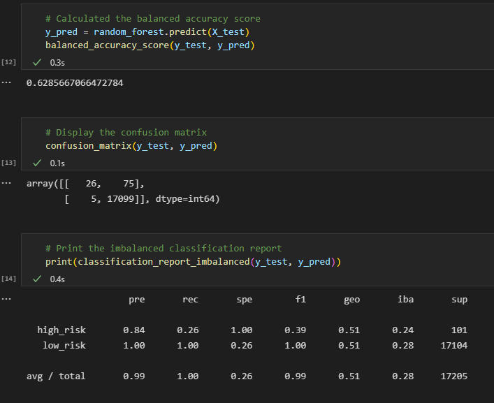
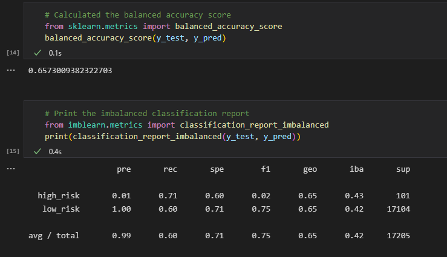
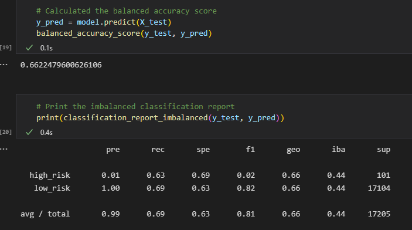
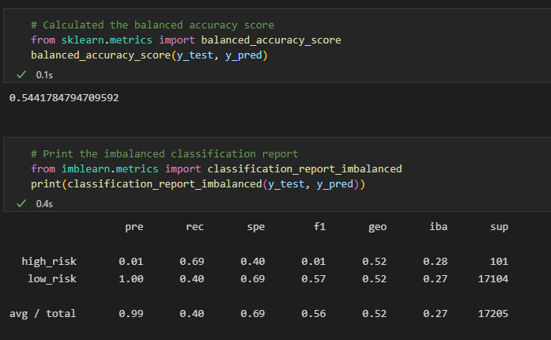
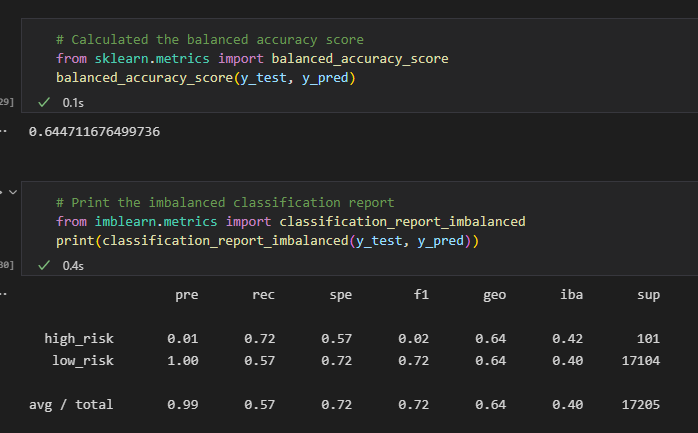
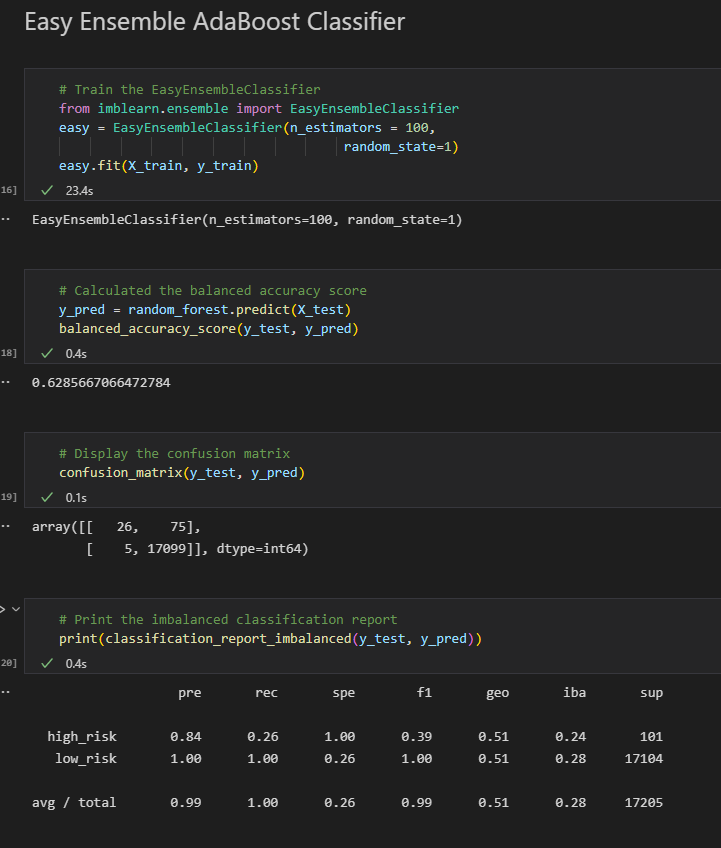

# Credit Risk Analysis
Module 17 challenge

## Overview
Analysis completed on behalf of client Jill to evaluate machine learning models with unbalanced classes- specifically using the imbalanced-learn and scikit-learn libraries.

## Results

### - Balanced Random Forest Classifier

### - Naive Random Oversampling

### - SMOTE (Synthetic Minority Oversampling Technique)

### - Undersampling

### - Combination Over & Under Sampling

### - Easy Ensemble

## Summary

With the highest accuracy level, Easy Ensemble Classifier seems to be the best fit for the clients needs, which includes determining credit risk. 
